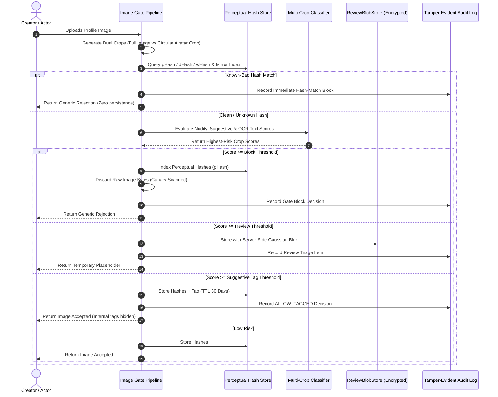
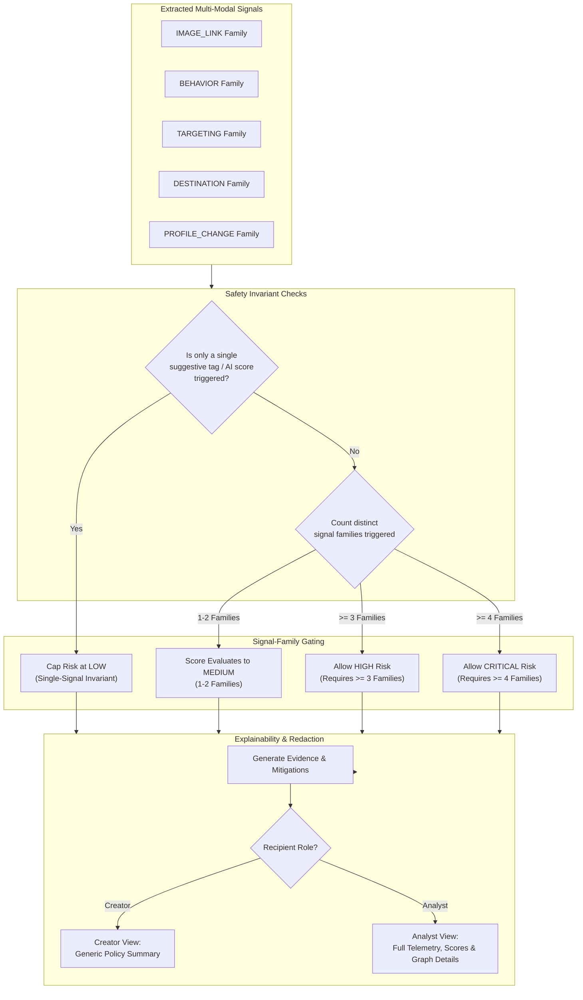
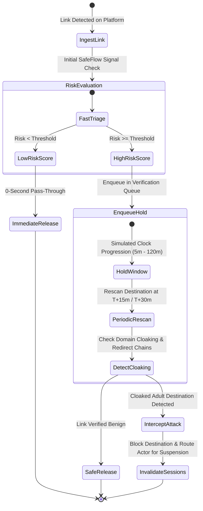

# SafeFlow

**An open, platform-agnostic trust & safety signal and decision engine.**

SafeFlow provides modular, multi-modal detection components (profile-image safety gate, media-reuse linking, text behavior analysis, high-space targeting, link/destination analysis) plus an explainable decision engine and graph clustering framework for detecting coordinated pathways that funnel users toward age-inappropriate destinations. Any platform can integrate SafeFlow through a thin adapter.

> [!IMPORTANT]
> **Non-Affiliation Notice:** SafeFlow is an independent, defensive research project. It is not affiliated with Google, YouTube, or any other platform, has no access to any platform's internal systems, and must never claim otherwise in code, docs, UI, or reports.

---

## Multi-Hop Pathway Attack vs. Detection

Traditional trust & safety systems inspect comments in isolation, allowing sophisticated redirection funnels to bypass filters. SafeFlow correlates signals across the entire multi-hop pathway:

```mermaid
flowchart LR
    subgraph S1["1. Attention Surface"]
        A1["Viral Space / Top Comment"]
        A2["Innocuous or Provocative Text"]
        A3["'Bio Link in Profile' Callout"]
    end

    subgraph S2["2. Profile Identity Surface"]
        P1["Suggestive / Procedural Avatar"]
        P2["Obfuscated Handle & Homoglyphs"]
        P3["External Destination Link in Bio"]
    end

    subgraph S3["3. Redirection / Destination"]
        D1["Shortener / Redirect Chain"]
        D2["Cloaked Activation (15-30m Delay)"]
        D3["Age-Inappropriate Host (.local)"]
    end

    subgraph S4["4. SafeFlow Decision Engine"]
        E1["Signal-Family Correlation (>=3 Families)"]
        E2["Graph Clustering & Co-Targeting"]
        E3["Calibrated Risk Scorer & Policy Action"]
    end

    S1 -->|"Directs Attention"| S2
    S2 -->|"Funnel Route"| S3
    S1 -.->|"Behavior & Targeting Signals"| S4
    S2 -.->|"Media & Bio Signals"| S4
    S3 -.->|"Destination & Cloak Signals"| S4
```



---

## End-to-End System Architecture

```mermaid
flowchart TD
    subgraph Ingestion["Platform Adapters & Ingestion"]
        P_VID["Video Comments Adapter"]
        P_FOR["Forum Communities Adapter"]
        P_CHT["Chat Servers Adapter"]
    end

    subgraph Signals["Signal Extraction Plugin Suite"]
        S_IMG["Media Reuse Plugin\n(pHash, dHash, wHash, IDF Discounting)"]
        S_TXT["Text Behavior Plugin\n(Repetition, TTR, TF-IDF Cosine, Velocity)"]
        S_TGT["Targeting Plugin\n(Space Popularity Percentile, Bipartite Co-Targeting)"]
        S_DST["Destination Plugin\n(Redirect Depth, Shorteners, Category Risk, Cloaking)"]
        S_PRF["Profile Plugin\n(Homoglyphs, Zero-Width, Bio Pattern Density)"]
    end

    subgraph Analysis["Correlation & Clustering Engine"]
        G_BLD["Heterogeneous Graph Builder\n(Nodes: Actor, Content, Media, Space, Dest)"]
        G_PRO["Bipartite Space Co-Targeting Projection"]
        G_CLU["Louvain / Connected Components Clustering"]
    end

    subgraph Decision["Explainable Decision Engine"]
        D_CAL["GroupKFold Calibrated Scorer"]
        D_HEU["Transparent Heuristic Scorer"]
        D_GAT["Signal-Family Gating Invariant\n(HIGH >= 3 families, CRITICAL >= 4 families)"]
        D_RED["Role-Based Redactor\n(Creator vs. Analyst Views)"]
    end

    subgraph Actions["Triage, Action & Observability"]
        Q_LNK["Simulated Clock Link Queue\n(Hold-and-Verify 5m-120m)"]
        UI_DSH["Analyst UI Dashboard\n(Server-Side Blur & 10-Reveal Cap)"]
        EXP_EVT["JSONL Exporter & Webhook Dispatcher"]
        AUD_LOG["Tamper-Evident Hash-Chained Audit Log"]
    end

    Ingestion --> Signals
    Signals --> Analysis
    Signals --> Decision
    Analysis --> Decision
    Decision --> Actions
```



---

## Profile Image Safety Gate Pipeline

SafeFlow evaluates image uploads using strict privacy and data minimization invariants:



---

## Explainable Decision Engine & Signal Gating

To prevent false-positive over-enforcement from isolated signals, SafeFlow enforces mathematical multi-family gating invariants:



---

## Threat Simulation Lab & Verification Queue Lifecycle



---

## Core Invariants & Safety Principles

1. **Facts vs. Policy**: Detectors output platform-neutral facts; policy packs define platform-specific actions, thresholds, and role-based views.
2. **Multi-Hop Redirection Pathway Analysis**: Connects attention surface signals (comments/posts) to identity surfaces (avatars/bios) and external destinations.
3. **Hard Safety & Zero-Harm Rules**:
   - **Zero Depictive Imagery**: Strictly zero explicit or scraped imagery. All test avatars are procedurally generated geometric placeholders.
   - **Canary-Scanned Zero Persistence**: Blocked images are immediately purged with zero storage on disk, memory, or database.
   - **No CSAM Scanning**: SafeFlow implements a strict immediate stop-and-report protocol (see [Responsible Research](docs/RESPONSIBLE_RESEARCH.md)).
   - **Analyst Wellbeing**: Server-side Gaussian blur is enabled by default with tamper-evident reveal logging and a 10-reveal session cap.
   - **Privacy Compliance**: Built-in GDPR/CCPA right-to-be-forgotten deletion cascades and structured data export utilities.

---

## Documentation

- [Project Status & Gate Verification](docs/STATUS.md)
- [Research Report](docs/RESEARCH_REPORT.md)
- [Architecture & Topology](docs/ARCHITECTURE.md)
- [Limitations & Scope](docs/LIMITATIONS.md)
- [Threat Model](docs/THREAT_MODEL.md)
- [Responsible Research Protocol](docs/RESPONSIBLE_RESEARCH.md)
- [Intended Use & Misuse Posture](docs/INTENDED_USE.md)
- [Prior Art & Dependency Licenses](docs/PRIOR_ART.md)
- [Architectural Decision Records](docs/DECISIONS.md)
- [Image Safety Policy](docs/IMAGE_POLICY.md)

---

## Quickstart

### 1. Installation

```bash
# Clone and install
git clone https://github.com/SafeFlow/safeflow.git
cd SafeFlow
pip install -e ".[dev]"
```

### 2. Interactive Terminal Walkthrough

```bash
python -m safeflow.cli.main demo --profile video_comments
```

### 3. Threat Simulation Sweep

```bash
python -m safeflow.cli.main simulate --scenario curiosity_surge --window 30
```

### 4. Compile Research Report

```bash
python -m safeflow.cli.main report --out docs/RESEARCH_REPORT.md
```

### 5. Launch REST API & Analyst Dashboard

```bash
python -m safeflow.cli.main serve --host 127.0.0.1 --port 8000
```
Open `http://127.0.0.1:8000/ui/index.html` in your browser to explore the dashboard.

---

## Python SDK Quickstart

```python
from safeflow.sdk.client import SafeFlowClient

client = SafeFlowClient(base_url="http://127.0.0.1:8000")

# 1. Gate an image upload
gate_result = client.gate_image(
    image_bytes=b"...",
    filename="avatar.png",
    policy_pack="general_video_platform",
    role="creator",
)
print("Gate Decision:", gate_result.decision)

# 2. Evaluate actor risk
signals = [
    {"family": "PROFILE_CHANGE", "name": "bio_callout", "value": 0.85, "producer": "profile_plugin"},
    {"family": "DESTINATION", "name": "max_risk", "value": 0.90, "producer": "dest_plugin"},
    {"family": "TARGETING", "name": "popular_concentration", "value": 0.80, "producer": "target_plugin"},
]
decision = client.evaluate_actor(actor_id="actor_123", signals=signals)
print("Actor Risk Level:", decision.level, "Score:", decision.score)
```

---

## Verification & Test Suite

Run the full test suite (88 passing unit, integration, and property tests):

```bash
pytest tests/ -v
```

---

## License

SafeFlow is licensed under the [Apache-2.0 License](LICENSE), subject to our ethical research commitments.

