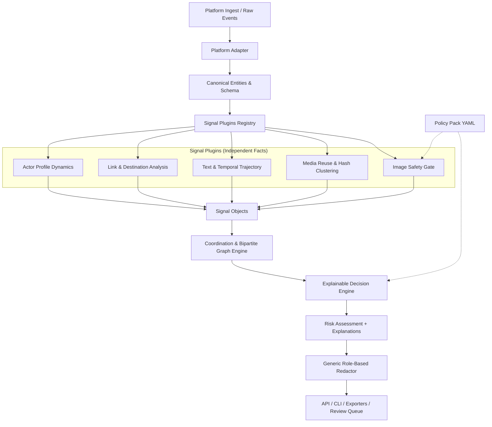
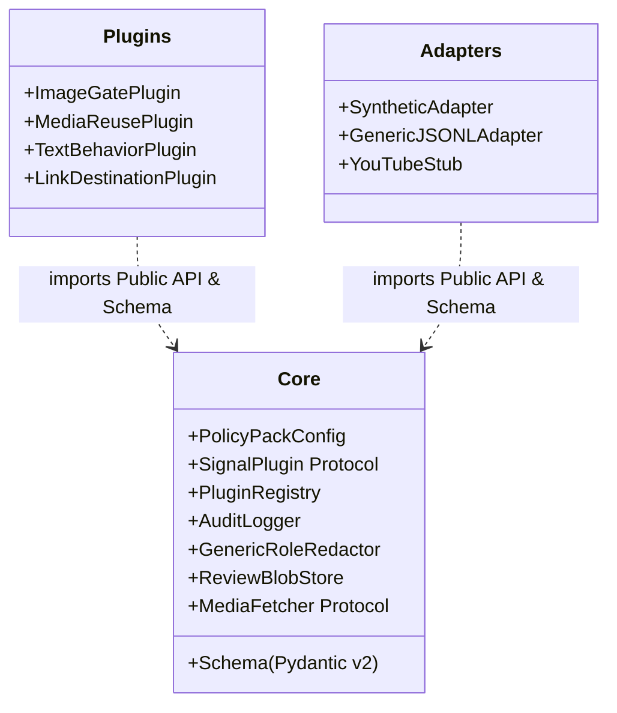

# SafeFlow Architecture

## 1. System Overview & Philosophy

**SafeFlow** is an open, platform-agnostic trust & safety signal and decision engine designed to detect coordinated pathways leading users toward age-inappropriate or malicious destinations. SafeFlow operates as an independent, defensive research project. It is not affiliated with Google, YouTube, or any commercial platform, and has no privileged access to internal platform infrastructure.

The core design principle of SafeFlow is:
> **Separate platform-neutral facts from platform-specific policy.**

- **Detectors and Signal Plugins** observe and emit objective facts (e.g., "perceptual hash distance is 2", "repetition rate is 0.85", "destination domain was registered 2 hours ago").
- **Policy Packs** define platform-specific thresholds, risk weighting, gating requirements, review behaviors, and recommended actions.

---

## 2. Redirection Pathway Model

Abuse rarely exists solely in a single isolated comment. Instead, actors construct **multi-hop redirection pathways** across different surfaces to evade content-level filtering:

1. **Attention Surface** (e.g., video comments, forum threads, chat server messages):
   - Outwardly benign, conversational, or engagement-seeking text designed to avoid simple keyword filters.
   - Designed to draw curiosity to the actor's profile or an alternate identity.
2. **Identity Surface** (e.g., avatar, profile banner, bio description, display name):
   - Suggestive imagery, bio text ("links below"), or homoglyph-obfuscated messages directing traffic.
3. **Secondary Surface** (e.g., intermediate profile, secondary channel, link-in-bio hub, pinned post):
   - Aggregates links, features other accounts, or provides instructions.
4. **External Destination** (e.g., external URL, redirector chain, landing page):
   - Out-of-platform age-inappropriate or exploitative sites, frequently utilizing cloaking, link shorteners, and delayed activation.

SafeFlow models these hops generically, allowing the detection engine to identify coordinated funnel patterns regardless of whether the platform is a video-sharing site, a discussion forum, or a chat network.

---

## 3. Component Architecture & Strict Import Boundaries

To maintain modularity and prevent domain coupling, SafeFlow enforces strict architectural boundaries:

### Strict Boundary Rules:
1. **Core Isolation**: `safeflow.core` **must never import** from `safeflow.plugins` or `safeflow.adapters`. Core defines protocols, schemas, configs, and registries; implementations register via entry points or explicit registry calls.
2. **Plugin Independence**: Plugins may import public classes from `safeflow.core` (such as `safeflow.core.schema`, protocols, and utilities), but **plugins may never import from each other**.
3. **Adapter Isolation**: Adapters convert raw platform data into canonical entities and may import `safeflow.core.schema`, but core never imports adapters.
4. **Test Enforcement**: Automated tests (`tests/test_import_boundaries.py`) inspect the AST and module graph of the codebase to guarantee these boundary rules are never violated.

---

## 4. Role-Based Redaction Architecture

Trust & Safety systems must defend against adversarial probing. If creators can observe internal feature scores, classifier probabilities, or reason strings, they can rapidly optimize evasion techniques (e.g., iterative avatar perturbations).

SafeFlow implements **Generic Field-Level Role Redaction**:
- **Field Annotations**: Plugin models and canonical models declare visibility using standard Pydantic `Field(..., json_schema_extra={"visibility": "analyst"})`.
- **Core Redactor**: The core redaction engine (`safeflow.core.roles.RoleRedactor`) inspects model metadata generically without importing or hardcoding plugin-specific models.
- **Role Enforcement**:
  - `CREATOR`: Receives minimal, non-actionable status (`ACCEPTED`, `UNDER_REVIEW`, `REJECTED`) and a generic message. Internal scores, tags, reason codes, and explanations are stripped.
  - `ANALYST`: Receives full detection results, feature breakdowns, evidence chains, and internal tags (`suggestive_presentation`). Every analyst access to tagged data is recorded in the audit log.
  - `ADMIN`: Full access including system configuration, policy pack reloading, and audit review.

---

## 5. ReviewBlobStore Architecture

To respect user privacy, minimize retention liability, and protect analysts:
1. **Zero Blocked-Image Disk Persistence**: Blocked images are never written to disk, databases, or logs. Only cryptographic/perceptual hashes and metadata are retained.
2. **Review Storage**: For images routed to human review (`REVIEW`), the temporary payload is managed by `ReviewBlobStore`:
   - Stored in-memory or encrypted at rest with AES-GCM.
   - **Auto-Purge TTL**: Configurable expiration (e.g., 24-hour review SLA); expired payloads are automatically purged.
   - **Server-Side Blurring**: Default image representations served to the review queue are aggressively blurred server-side using Gaussian convolution.
   - **Logged Reveals**: Analysts must explicitly request an unblurred reveal.
   - **Session Reveal Cap**: To prevent fatigue and scraping, a per-session limit (e.g., maximum 50 unblurred reveals per analyst session) is enforced.

---

## 6. Media Fetcher & Rescan Architecture

Profile images require periodic rescan when:
- The actor updates their profile avatar.
- A new model version is deployed (`model_version` bump).
- A periodic verification interval elapses (`rescan_interval_days`).

Because SafeFlow core does not scrape or connect directly to platforms, it defines a host-provided `MediaFetcher` protocol:
- **Rescan Request Events**: The engine emits `RescanRequest(actor_id, media_id, reason)` events.
- **Fetch Protocol**: The host application or adapter implements `fetch_media(media_id) -> bytes`.
- **Ephemeral Processing**: Fetched media is processed in-memory through the gate. Allowed avatars are **not cached** unless explicitly enabled via `cache_allowed_media: true` with a strict TTL (default `false`).

---

## 7. Tamper-Evident Audit Logging

All gate outcomes, configuration thresholds, model versions, and analyst tag inspections are logged to an append-only audit trail.
To ensure integrity, audit records implement a cryptographic **hash-chain**:
$$\text{RecordHash}_i = \text{SHA256}(\text{PrevHash}_{i-1} \parallel \text{Timestamp} \parallel \text{EventType} \parallel \text{PayloadJSON})$$
Any retroactive modification of audit entries breaks the hash chain, enabling verification by compliance auditors.
